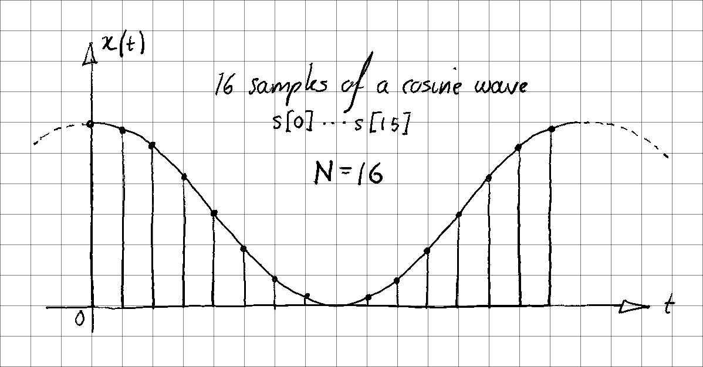
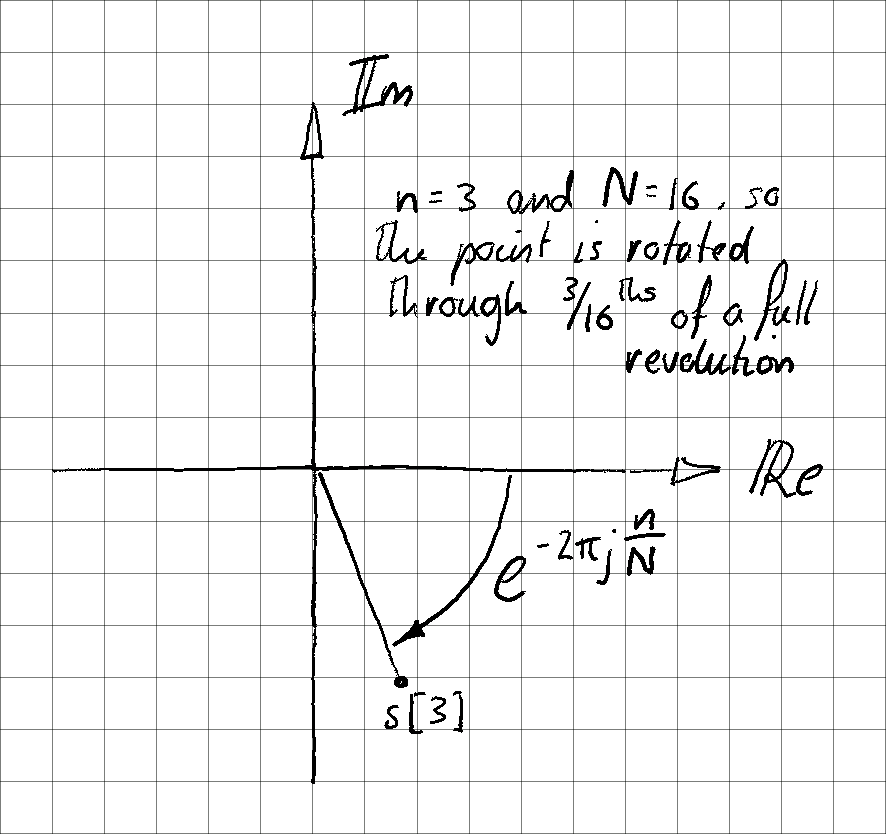
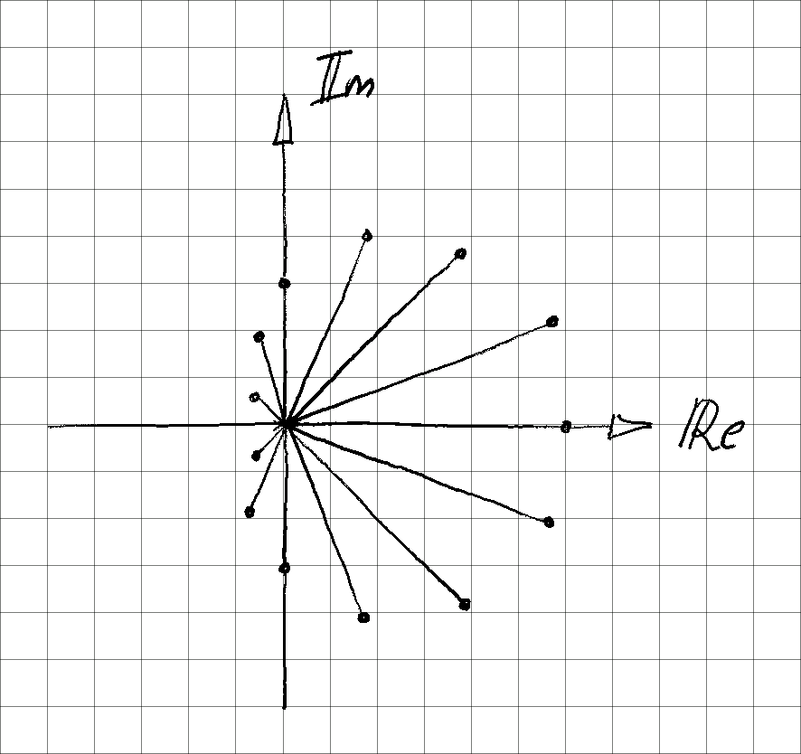
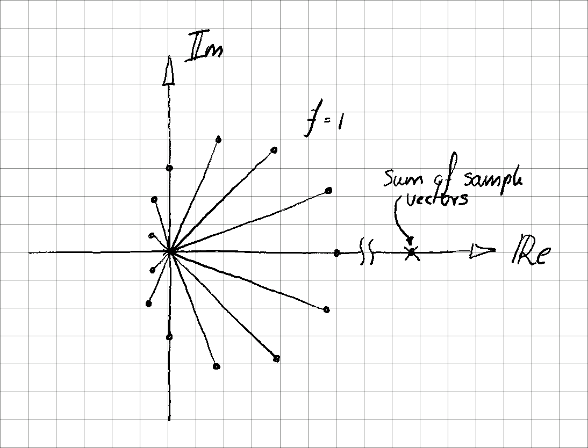
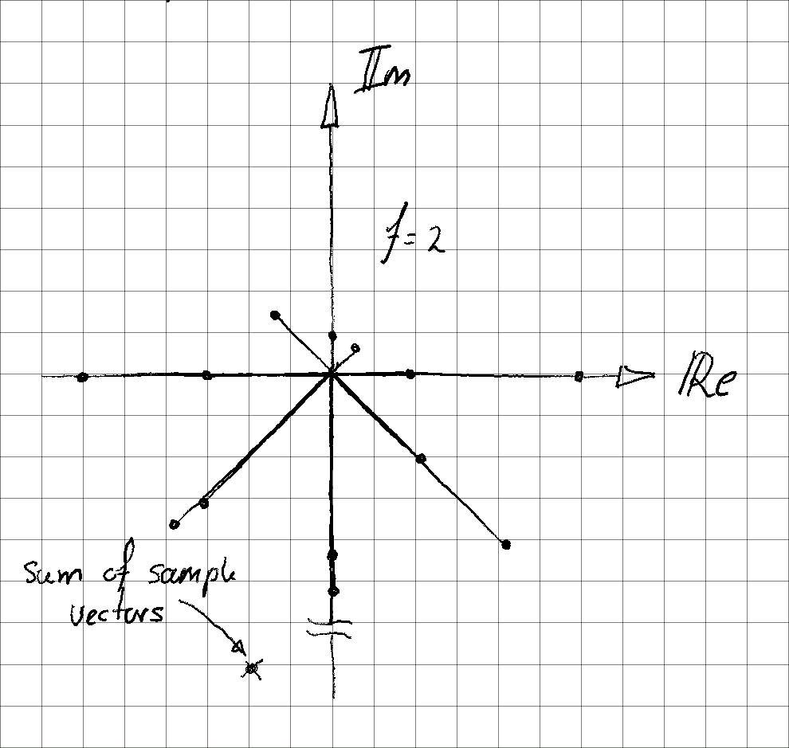
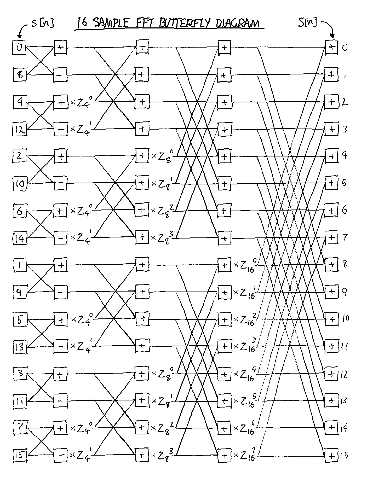
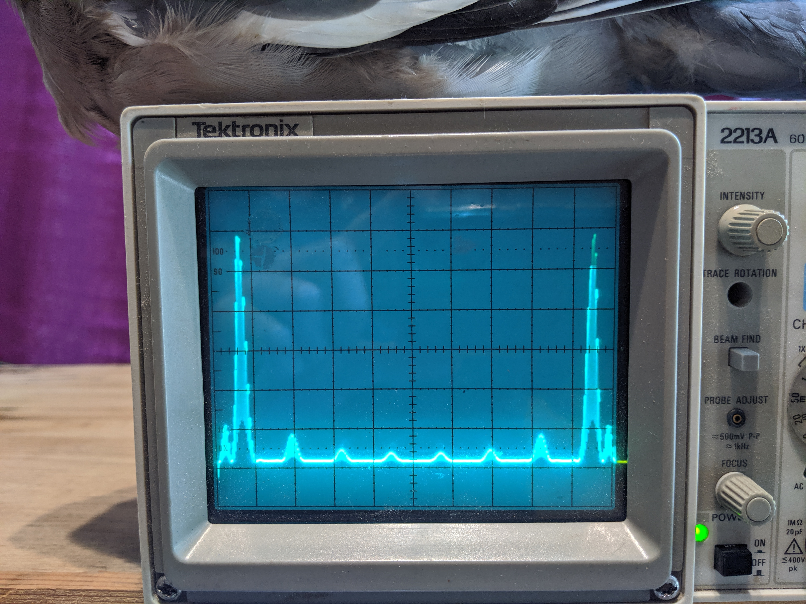

# **Implementing the Fast Fourier Transform**

The core aspect of my project is to perform spectrum analysis on an analogue voltage waveform digitised by an ADC. To do this I have implemented the Fast Fourier Transform (FFT).

## **The mathematics**

The FFT algorithm is an specific optimisation of the Discrete Fourier Transform (DFT), the mathematical method for determining the frequency content of a discrete set of samples of a signal. A naive algorithmic implementation of the DFT, as it is defined, would have a computation time of


, meaning the time it would take to compute is proportional to the square of the number of samples (N). The FFT has a computation time of 


, a vast improvement over the DFT, especially for large N. Here's how it works:

Consider a sequence of samples "s" of length N, where any particular sample is found using an index into the sequence, as s[n]. The Discrete Fourier Transform produces an output sequence S of the same length, where each of the entries in the sequence are frequency components. Therefore, for any frequency f, the DFT is defined as

<br/>
<div style = "text-align:center">


</div>
<br/>

This is a sum over all the samples in the input sequence, multiplied by a complex exponential coefficient, at a particular frequency.

To understand what the DFT is doing Consider a series of samples of a cosine wave:
<div align="center">

</div>

If the samples are viewed on the complex plane, multiplying the value of each sample by 


rotates it anticlockwise through an angle that is equivalent to it's position in the sample sequence.

<div align="center">

</div>

Doing this for each sample spreads the samples out with equal spacing around the unit circle on the complex plane.

<div align="center">

</div>

The sum is the same as adding up all of these vectors and finding their end point.

<div align="center">

</div>

the value of f in the DFT represents the number of rotations through wich the points are wrapped around the complex plane. For instance if f = 1 the points will be spread evenly over one revolution, if f = 2 the points will be spread evenly over two revolutions (when f = 0 all of the vectors are simply added together end to end with no rotation, this represents the DC component of the signal).

f can be seen as the frequency component of the signal currently being analysed. The number of times the points are wrapped around will change the ultimate value of the sum, the real part of which represents "how much" of the signal is present at that particular frequency.

<div align="center">

</div>

It turns out that the DFT sum is exactly equivalent to first taking the sum of all the even terms in the sequence, then the sum of all the odd terms and then adding these sums together.

<br/>
<div style = "text-align:center">


</div>
<br/>

expanding the exponent of e gives

<br/>
<div style = "text-align:center">


</div>
<br/>

and multiplying f into one of the exponents

<br/>
<div style = "text-align:center">


</div>
<br/>

The second sum now has a multiplicative factor that no longer depends on the particular entry in the sequence, m, so it can be factorised out of the sum.

<br/>
<div style = "text-align:center">


</div>
<br/>

Comparing with the original definition of the DFT it is now clear the two sums in the equation above are themselves simply the DFT of all the even terms and the DFT of all the odd terms.

<br/>
<div style = "text-align:center">


</div>
<br/>

These DFT's can continue to be broken down recursively using the same process until all that is left are pairs of samples from the input sequence. 

This recursion is neat but it is not actually where the speed improvement of the FFT comes from. This is just a recursive expression of the DFT. The important fact is that the even and odd sub-sequences have twice the periodicity of the original sequence, meaning the value of the even and odd sums will repeat as f goes from 0 to N - 1. Computationally it would be a waste to calculate these repeated values more than once.

As the recursion descends the values of the remaining sums repeat more and more often with increasing f, until at the very bottom of the recursion the result of the DFT simply alternates back and fourth between two values as f increases. This can be shown by taking the DFT of a pair of samples (N = 2)

<br/>
<div style = "text-align:center">


</div>
<br/>

As f is increased in integer steps from 0 the value of 


toggles between 1 and -1. This is because 


and is periodic with 

.

So the only unique values of the sum down here at the bottom of the recursion are s[0] + s[1] and s[0] - s[1]. (Note that f still varies from 0 to whatever the original length, N, of the full sequence was). The naive recursive method would wastefully calculate these two results over and over again. Instead, for the same number of steps we could calculate these two unique results for all of the other pairs of samples from the input sequence, i.e. s[2] + s[3] and s[2] - s[3], s[4] + s[5] and s[4] - s[5], s[6] + s[7] and s[6] - s[7] and so on...

*on a side note my use of sequential indices here is a bit misleading. Since these pairs represent the even and odd subsets of sequences that are themselves the even and odd subsets of other sequences, the indices will be shuffled around quite a bit. Here's an example for a sequence of 8 samples:*

<br/>
<div style = "text-align:center">


</div>
<br/>
<div style = "text-align:center">


</div>
<br/>
<div style = "text-align:center">


</div>
<br/>
The resulting shuffled sequence is:

</br>
<div style = "text-align:center">


</div>
<br/>

The periodicity in the results of the DFT in f can be exploited at each level up the recursion until the very top. The method for doing so is rather difficult to put into words, but can be explained more easily using a "butterfly diagram". The following butterfly diagram shows the stages of computing the FFT for an input sequence of 16 samples. At each stage the frequency components are calculated as the sum of the even component from the previous stage and a coefficient 

 multiplied by the odd component. 

<div align="center">

</div>

The coefficients in the diagram above are represented as

</br>
<div style = "text-align:center">


</div>
<br/>

The butterfly diagram shows all of the unique calculations that must be performed on the 16 input samples to get the 16 frequency components at the output. In total there are 64 sums / differences that have to be performed, which is exactly


of N = 16.

## **Implementation details**

There are a number of optimisations that I have made in my implementation of the FFT, so as to get reasonable performance on the STM32 Nucleo development board. The first is to exploit the fact that the stm32l476rg microcontroller has a built in floating point co-processor.

### **Floating Point Unit**

The Cortex-M4 Floating Point Unit (FPU) is only capable of single precision arithmetic (32-bit wide floating point values) but has high performance, being able to do floating point addition and subtraction in a single cycle and floating point multiply-add / multiply-subtract in only three cycles.

Enabling the FPU is done simply by writing four bits in the "Coprocessor access control register" (CPACR) when the microprocessor boots.

```C++
    CPACR |= (0b1111 << 20);
```
This is done in [startup_stm32l476rg.c](https://github.com/AVatLeeds/ELEC2645-project/blob/master/startup_stm32l476rg.c#L380) at line 380.

The compiler also has to be instructed to generate ARM floating point instructions using the flags ```-mfloat-abi=hard``` and ```-mfpu=fpv4-sp-d16```. These tell the compiler to use the hardware floating point application binary interface and what specific version of FPU to produce instructions for. Without these flags the compiler would generate piles of ordinary integer arithmetic instructions that would simulate the floating point operations, at a great performance reduction.

### **Pre-computation optimisations**

my FFT library, [fast_fourier_transform.cpp](https://github.com/AVatLeeds/ELEC2645-project/blob/master/fast_fourier_transform.cpp) and [fast_fourier_transform.h](https://github.com/AVatLeeds/ELEC2645-project/blob/master/fast_fourier_transform.h), provide a class called FFT. The second important optimisation appears in the constructor of this class.

```C++
    FFT::FFT()
    {
        // precompute coefficients for the maximum FFT length
        // The FFT length is represented by an exponent, since it must alway be a power of 2
        // To save memory and exploint the symetries of the coefficients calculation, only half of the coefficients are calculated.
        // Precomputing the coefficients in this way discards any of the complex (phase) information in the FFT. Might change this later.
        // The iterator f represents the frequency component.
        unsigned int max_FFT_length = 1U << MAX_EXPONENT;
        for (unsigned int f = 0; f < _num_coefficients; f ++)
        {
            _coefficients[f] = cos((2.0F * M_PI * static_cast<float>(f)) / static_cast<float>(max_FFT_length));
        }
    }
```
As I showed in my explanation of the mathematics complex exponential "coefficients" can be factored out of the recursive DFT. The nice thing is that these coefficients can be computed up-front, saving many floating point operation inside the actual FFT computation. Indeed, all that is needed is to calculate an array of these coefficients that is as long as the maximum FFT length when the class is constructed. This only needs to be done once.

In my FFT implementation I am presently only interested in the real component of the results (the FFT produces complex values, the imaginary part representing phase information). This means I can simplify the complex exponential coefficient down to a simple calculation using the cosine to get the real part of the coefficient.

</br>
<div style = "text-align:center">


</div>
<br/>

The next step in using the library is to call the "setup" method to set the length of the FFT and provide a pointer to the input samples.

```C++
    void FFT::setup(float samples[], unsigned int num_samples)
    {
        _samples = samples;
        _num_samples = num_samples; 
        while (num_samples --)
        {
            num_samples >>= 1;
            _FFT_in_width ++;
        }
        _FFT_in_length = (1U << _FFT_in_width);
        shuffle_indicies(_indicies, _FFT_in_width);
    }
```

The setup function uses a while loop to calculate the maximum bit width required to encompass the number of input samples specified (The size of the FFT must be a power of 2 for the algorithm to work correctly). It then calls "shuffle_indices". In the mathematical explanation I mentioned that splitting the even and odd terms of the sample sequence repeatedly causes the values in the sample sequence to become "shuffled". It turns out that the positions that the samples would be moved to in the shuffling process are the exact bit reversal of their original index. For instance:

| sample index | in binary | bits reversed | shuffled index |
|--------------|:---------:|:-------------:|:--------------:|
|0             |000        |000            |0               |
|1             |001        |100            |4               |
|2             |010        |010            |2               |
|3             |011        |110            |6               |
|4             |100        |001            |1               |
|5             |101        |101            |5               |
|6             |110        |011            |3               |
|7             |111        |111            |7               |

I my case it would be unreasonable to actually reposition the values in the samples array. My library should not interfere in a non-transparent way with the input data provided by the user. Instead I generate an array of "shuffled indices". Indexing normally into the ```_indicies``` array will produce bit reversed indices that can be used to select the correct value from the samples array.

```C++
    void shuffle_indicies(uint16_t indicies[], unsigned int exponent)
    {
        for (unsigned int idx = 0; idx < (1U << exponent); idx ++)
        {
            unsigned int reverse_idx = 0;
            for (unsigned int i = 0; i < exponent; i ++)
            {
                reverse_idx <<= 1;
                reverse_idx |= ((idx >> i) & 1U);
            }
            indicies[idx] = reverse_idx;
        }
    }
```

This also means that the somewhat lengthy bit reversal process only needs to be performed once when the FFT parameters are set up rather than every time the FFT is calculated.

### **Attempting the algorithm**

For my first experiments with getting the FFT algorithm to work I created a test program, [FFT_algorithm_tests.cpp](https://github.com/AVatLeeds/ELEC2645-project/blob/master/FFT_algorithm_tests.cpp), intended to run on my PC. It takes an array of dummy floating point samples as an input and prints out a list of the computed terms of the transform. I could then plot these in a spreadsheet to ensure they were as I expected.

My initial attempt produced an algorithm that recursively computed the DFT (not an FFT). At this point I hadn't quite understood the mathematics of where the performance gain of the FFT came from. I implemented this algorithm on the microcontroller as the [recursive_DFT](https://github.com/AVatLeeds/ELEC2645-project/blob/master/fast_fourier_transform.cpp#L25) method of the FFT class. Unsuprisingly the performance was very poor.

With these tests I was at least able to verify that certain aspects worked. Like the shuffling of the array indicies and sub-sampling the array of coefficients.

After further experimenting and reading of the mathematics I was able to write a true implementation of the FFT algorithm with


performance.

### **Final implementation**

The ```compute_FFT``` method returns a pointer to a private array of floating point values, the results from computing the FFT. This array is pre-allocated with enough space for the results of the largest width FFT, 2^13 (8192).

```C++
    float * FFT::compute_FFT()
    {
        // populate the results array with the sums and differences of each pair of shuffled samples
        for (unsigned int f = 0; f < _FFT_in_length; f += 2)
        {
            unsigned int even_idx = _indicies[f];
            unsigned int odd_idx = _indicies[f + 1];
            _results[f] = _samples[even_idx] + _samples[odd_idx];
            _results[f + 1] = _samples[even_idx] - _samples[odd_idx];
        }
        // a second pass over the array takes advantage of a special case that 4 evenly spaced points
        // on the unit circle yield coefficients with real part 1.0, 0,0, -1.0 and 0.0
        for (unsigned int f = 0; f < _FFT_in_length; f += 4)
        {
            float sum = _results[f] + _results[f + 2];
            float diff = _results[f] - _results[f + 2];
            _results[f] = sum;
            _results[f + 2] = diff;
        }
        // the two for loops above take care of the conditions that would be width = 0 and width = 1
        unsigned int width = 2;
        // each value of width here is equivalent to a layer on the butterfly diagrem.
        while (width < _FFT_in_width)
        {
            // this value is used to shift (raise to a power of 2) the frequency component f so that
            // it correctly sub-samples the coefficients array
            unsigned int coeff_shift = MAX_EXPONENT - (width + 1);
            unsigned int offset = (1U << width);
            for (unsigned int f = 0; f < _FFT_in_length; f ++)
            {
                if (f & offset)
                {
                    f += offset;
                }
                float temp = (_coefficients[(f << coeff_shift) & _coeff_idx_mask] * _results[f + offset]);
                float diff = _results[f] - temp;
                _results[f] = _results[f] + temp;
                _results[f + offset] = diff;     
            }
            width ++;
        }

        return _results;
    }
```

There are a few more optimisations that I have managed to squeeze into my final implementation of the FFT. For example, I have removed the recursion. This saves the overhead of a recursive function call, whereby the current state of the function has to be saved on the stack before descending into the next layer of the recursion. This only represents a small overhead but over many function calls it adds up.

My implementation is a so-called "compute in place" FFT, meaning, with each iteration, the results are stored stored back into the same ```_results``` array, overwriting the results from the previous layer. This saves the memory overhead of having to have multiple buffers in RAM for the source data and results.

There is a neat optimisation at the second layer of the FFT (the second for loop) which takes advantage of the fact that for four evenly spaced points on the unit circle the real part of two of the points is zero, so these terms do not need to be calculated.

There are still a few small bugs remaining in my impementation and probably still plenty of room for further optimisations.

### **Results**

Here's a picture of my FFT algorithm computing and displaying a 1024 point FFT of some square wave data.

<div align="center">

</div>
<br/>

(Note the symmetry. In accordance with the Nyquist Criterion the FFT only produces unique values for the frequency components up to f = N / 2, after which the spectrum is mirrored.)